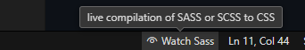

# styla
For now, a custom expansion to the latest version of Bootstrap.

## NEW! INCOMING! EXCITING UPDATES!

- Styla as Ruby Gem
- Deprecting any dependance on bootstrap
- You will be able to customize every mayor aspect of the design from a .yml file. Those aspects include:
  - The primary and secondary colors
  - If the grayscale palette is warm, cold, neutral or even color customized!
  - The ammount and type of aviable components
  - If you want to use Styla Components™️ or you only want to use the layouts and utilites
- Introducing: Styla-chan! Our lovely mascot. Her colors are Purple (Bootstrap, the past) and Red (Ruby, the future)!

---

> Legacy instructions for compilation (ES)

# Instrucciones para compilación

Instalar <a href="https://marketplace.visualstudio.com/items?itemName=glenn2223.live-sass">Live Sass Compiler</a> para VSCode

El archivo principal es:

```
styla/style.scss
```

Mantener activada opción para auto compilar



Cada cambio hecho en `style.scss` se verá reflejado en archivo a utilizar:

```
styla/style.css
```

**Esperar cambios fuertes en la estructura de este proyecto.**

# Cambios recientes 📫

- 5 clases nuevas para manejar opacidad
- Componente de tooltips creado
- Estado de DANGER 🔴 para los formularios
- Strength meter aniadido desde dannyimplementa